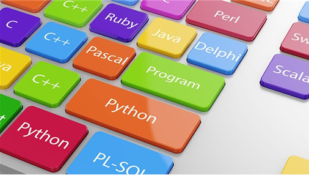

# Coding 💎

 

##  Schedules 🎅

* Week 1 : [한국정보올림피아드](competition/한국정보올림피아드)
* Week 2 : [Dynamic Programming](study/dynamic_programming)
* Week 3 : [Graph](study/graph)
* Week 4 : [Stack, Queue and Deque](study/stack_queue)
* Week 5 : [Greedy and Brute Force](study/Greedy_Brute)

* week ~ : [Binary Search & Sorting](#)
* Week ~ : [Shortest Path and Minimal Spanning Tree](#)

# Subjects 🗃️
## [탐욕과 브루트 포스](study/Greedy_Brute) 🐣
 

 

## [스택과 큐](study/stack_queue) 🐣
 

  

## [디피(동적계획법)](study/dynamic_programming) 🐣
 

 

## [그래프](study/graph) 🐣
 

# Competitions 🏆
* [프로그래머스](competition/프로그래머스)
* 한국정보올림피아드
* 카카오_코드페스티벌

