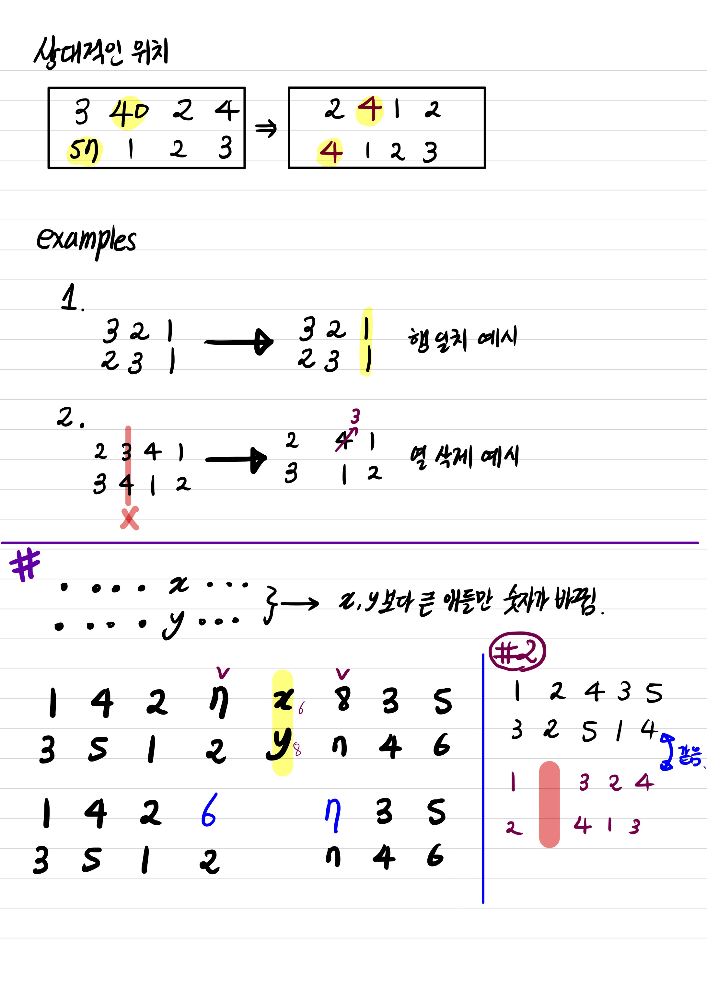

# 조화로운_행렬

[문제 링크](https://www.acmicpc.net/problem/15977)


## 문제 이해   

2행 또는 3행의 행렬이 주어진다. 열의 길이는 N으로 주어진다. 
등수행렬은 한 행에서 값의 크기에 따라서 순서를 매겼을 때, 주어지는 행렬이다. 크기 비교는 한 행 내에서만 이루어진다. 
문제는 열-부분행렬 중에서 조화행렬을 찾는 것이다. 여기서 조화행렬이란, 모든 행에 대해서 등수의 순서가 같은 행렬이다. 

### examples

---

|열번호|1|2|3|4|
|:-:|:-:|:-:|:-:|:-:|
|-|10|7|4|1|
|-|6|3|2|5|

행렬이 다음과 같이 주어진다면 등수행렬은 아래와 같다.

|열번호|1|2|3|4|
|:-:|:-:|:-:|:-:|:-:|
|-|1|2|3|4|
|-|1|3|4|2|

이 행렬은 첫번째와 두번째 행의 값이 다르므로 조화행렬이 아니다. 

---

아래 행렬은 조화행렬이다. 


|열번호|1|2|3|4|
|:-:|:-:|:-:|:-:|:-:|
|-|10|5|4|7|
|-|6|3|2|5|
|-|4|2|1|3|


|열번호|1|2|3|4|
|:-:|:-:|:-:|:-:|:-:|
|-|1|3|4|2|
|-|1|3|4|2|
|-|1|3|4|2|




...

## 풀이 전략

* 정렬을 해서 상대적인 크기를 나타낸다. 
* 상대적인 크기가 같은 열은 제외시키고 COUNT를 1 증가시킨다. 
* C개의 열 중에서 두 행의 차이를 최소한으로 줄이는 열을 삭제한다. 
* 열이 더 이상 남지 않을 때까지 반복.  


위의 그림에서 각 열에 대한 차이는 다음과 같이 계산할 수 있다. 

||c1|c2|c3|c4|c5|c6|c7|c8|
|:-:|---|---|---|---|---|---|---|---|
|행1|1|4|2|7|6|8|3|5|
|행2|3|5|1|2|8|7|4|6|
|차이|**2**| **1**| **1**| **5**| **2**| **1**| **1**| **1**|
|c5삭제 후 </br>차이|2|1|1|**4**</br>7->6|**0**</br>삭제|**0**</br>8->7|1|1|


## 고민

1. Greedy하게 다음에 두 행의 차이를 최소로 줄이는 열을 삭제한다면 최적해에 도달할 수 있는가?

### 고민 해결

1. 글쎄?

없음.

## Sudo Code

      SET MAT = R x C matrix
      SET count = 0
      FOR r(행) = 1,2,...R
          r = (index, 원소)의 리스트로 변환
          r' = 원소에 대해서 Descending 정렬
          for i=1,1, ..., C
              MAT[r][r'의 i번째 원소의 인덱스] = i 
      END FOR


# 선택 사항

* 구현
* 관련 알고리즘
* 관련 문제


```
cat examples/ex1 | py run.py
```