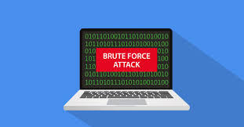

# Greedy And BruteForcing

## 1. Assigned 📌
### [ACMIC homework Link 👨‍💻](https://www.acmicpc.net/group/practice/9719/4)
|name|solution|key words|
|:-:|:-:|:-:|
|퇴사|[Unsolved](problems/퇴사)|Brute Force|
|A->B|[Unsolved](problems/ab)|Greedy|
|숫자야구|[Solved by Bumjin](problems/숫자야구)|Brute Force|
|단어 수학|[Unsolved](problems/단어수학)|Greedy|

## 2. Free 🤗
[Greedy Problems 👩‍💻](https://www.acmicpc.net/problemset?sort=ac_desc&algo=33)
[Bruteforcing👩‍💻](https://www.acmicpc.net/problemset?sort=ac_desc&algo=125)

자유롭게 풀고 풀이를 올린 문제

|name|solution|key words|info|
|:-:|:-:|:-:|:--|
|거스름돈|[Solved by Bumjin](problems/거스름돈)|잔돈 계산하기 | 쉬움
|카드정렬하기|[Solved by Bumjin](problems/카드정렬하기)|Greedy 알고리즘으로 카드 정렬 순서를 최소화 시키는 문제| Heap을 사용하면 쉽게 풀 수 있음. |
|덩치|[Solved by Bumjin](problems/덩치)|List 원소를 비교해서 순위를 정하는 문제, Brute Force|

## Greedy Alogirhtm 🦄

탐욕 알고리즘은 최적해를 구하는 데에 사용되는 근사적인 방법으로, 여러 경우 중 하나를 결정해야 할 때마다 그 순간에 최적이라고 생각되는 것을 선택해 나가는 방식으로 진행하여 최종적인 해답에 도달한다. 순간마다 하는 선택은 그 순간에 대해 지역적으로는 최적이지만, 그 선택들을 계속 수집하여 최종적(전역적)인 해답을 만들었다고 해서, 그것이 최적이라는 보장은 없다. 하지만 탐욕알고리즘을 적용할 수 있는 문제들은 지역적으로 최적이면서 전역적으로 최적인 문제들이다.

탐욕 알고리즘이 잘 작동하는 문제는 대부분 탐욕스런 선택 조건(greedy choice property)과 최적 부분 구조 조건(optimal substructure)이라는 두 가지 조건이 만족된다. 탐욕스런 선택 조건은 앞의 선택이 이후의 선택에 영향을 주지 않는다는 것이며, 최적 부분 구조 조건은 문제에 대한 최적해가 부분문제에 대해서도 역시 최적해라는 것이다.

## BruteForcing 🦄

암호학에서, 무차별 대입 공격(영어: brute-force attack)은 특정한 암호를 풀기 위해 가능한 모든 값을 대입하는 것을 의미한다. 대부분의 암호화 방식은 이론적으로 무차별 대입 공격에 대해 안전하지 못하며, 충분한 시간이 존재한다면 암호화된 정보를 해독할 수 있다. 하지만 대부분의 경우 모든 계산을 마치려면 실용적이지 못한 비용이나 시간을 소요하게 되어, 공격을 방지하게 한다. 암호의 '취약점'이라는 의미에는 무차별 대입 공격보다 더 빠른 공격 방법이 존재한다는 것을 의미한다.
