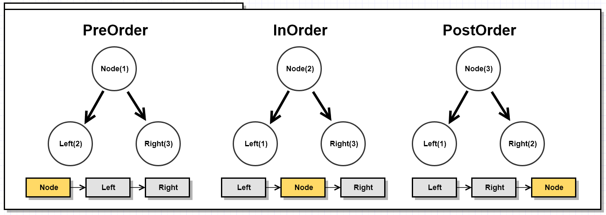

# Graph

### [ACMIC homework Link 👨‍💻](https://www.acmicpc.net/group/practice/9719/2)
### [All of Graph Problems 👩‍💻](https://www.acmicpc.net/problemset?sort=ac_desc&algo=7)

1. Assigned Problems
2. Free problems
3. Algorithms 
4. Tree traversal

## Assigned 📌

|name|solution|key words|
|:-:|:-:|:-:|
|[The Great Revegetation (Silver)](https://www.acmicpc.net/problem/17038)|||
|[Cycle Detection](https://www.acmicpc.net/problem/7097)|||
|[촌수계산](https://www.acmicpc.net/problem/2644)|||
|[Count Circle Groups](https://www.acmicpc.net/problem/10216)|||
|[부등호](https://www.acmicpc.net/problem/2529)|||

## Free 🤗

자유롭게 풀고 풀이를 올린 문제

|name|solution|key words|info|
|:-:|:-:|:-:|:--|
|섬의개수|[Solved by Bumjin](problems/섬의개수)|bfs |bfs 기본 문제, max recursion을 setting 해야 풀 수 있음. |
|이진 검색 트리|[Solved by Bumjin](problems/이진검색트리)|트리, 전위, 후위 순회|트리를 만들지 않고도 풀 수 있다. 하지만 나는 트리를 만들어서 풀었다.|

## Algorithms 

* [이미지 출저 및 설명](https://towardsdatascience.com/10-graph-algorithms-visually-explained-e57faa1336f3)

|**BFS(Breath First Search)**|**DFS(Depth First Search)**|
|---|---|
|||

|**Minimal Spanning Tree**|**Shortest Path**|**Cycle Detection**|
|:-:|:-:|:-:|
||||
|[Prim’s algorithm](algorithms/Prim)   [Kruskal’s algorithm](algorithms/Kruskal)|[Dijkstra’s shortest path algorithm](algorithms/DijkstraShortestPath)  [Bellman–Ford algorithm](algorithms/Bellman–Ford)|[Floyd cycle detection algorithm](algorithms/Floyd%20cycle%20detection%20algorithm)  [Brent’s algorithm](algorithms/Brent’s%20algorithm)|

|**Strongly Connected Components**|**Topological Sorting**|**Graph Colouring**
|:-:|:-:|:-:|
||||
|[Kosaraju’s algorithm](algorithms/Kosaraju) [Tarjan](algorithms/Tarjan’s%20strongly%20connected%20components)| [Kahn’s algorithm](algorithms/Kahn)   [based on depth-first search](algorithms/Topological_dfs)|[Algorithms using BFS or DFS](algorithms/graph_colouring_bfs_dfs)   [Greedy colouring](algorithms/Greedycolouring) |

## Tree 순회

<kbd>

</kbd>

|PreOrder|InOrder|PostOrder|
|:-:|:-:|:-:|
|**Node**-Left-Right|Left-**Node**-Right|Left-Right-**Node**|