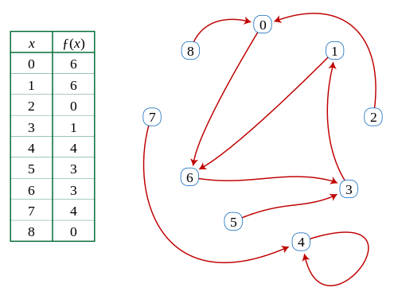
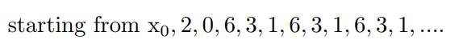
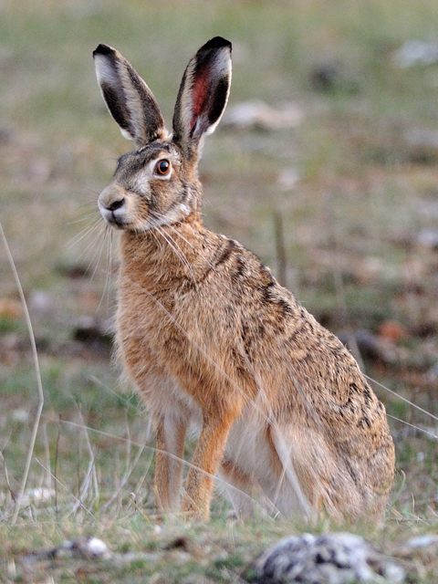

# Floyd cycle detection algorithm




Graph




|tortoise(남생이)|hare(토끼)|
|---|---|
|| |

## Source code 

```python
def floyd(f, x0):
    # Main phase of algorithm: finding a repetition x_i = x_2i.
    # The hare moves twice as quickly as the tortoise and
    # the distance between them increases by 1 at each step.
    # Eventually they will both be inside the cycle and then,
    # at some point, the distance between them will be
    # divisible by the period λ.
    tortoise = f(x0) # f(x0) is the element/node next to x0.
    hare = f(f(x0))
    while tortoise != hare:
        tortoise = f(tortoise)
        hare = f(f(hare))
  
    # At this point the tortoise position, ν, which is also equal
    # to the distance between hare and tortoise, is divisible by
    # the period λ. So hare moving in circle one step at a time, 
    # and tortoise (reset to x0) moving towards the circle, will 
    # intersect at the beginning of the circle. Because the 
    # distance between them is constant at 2ν, a multiple of λ,
    # they will agree as soon as the tortoise reaches index μ.

    # Find the position μ of first repetition.    
    mu = 0
    tortoise = x0
    while tortoise != hare:
        tortoise = f(tortoise)
        hare = f(hare)   # Hare and tortoise move at same speed
        mu += 1
 
    # Find the length of the shortest cycle starting from x_μ
    # The hare moves one step at a time while tortoise is still.
    # lam is incremented until λ is found.
    lam = 1
    hare = f(tortoise)
    while tortoise != hare:
        hare = f(hare)
        lam += 1
 
    return lam, mu


```

---

## refrence
[Cycle Detection Wiki](https://en.wikipedia.org/wiki/Cycle_detection)