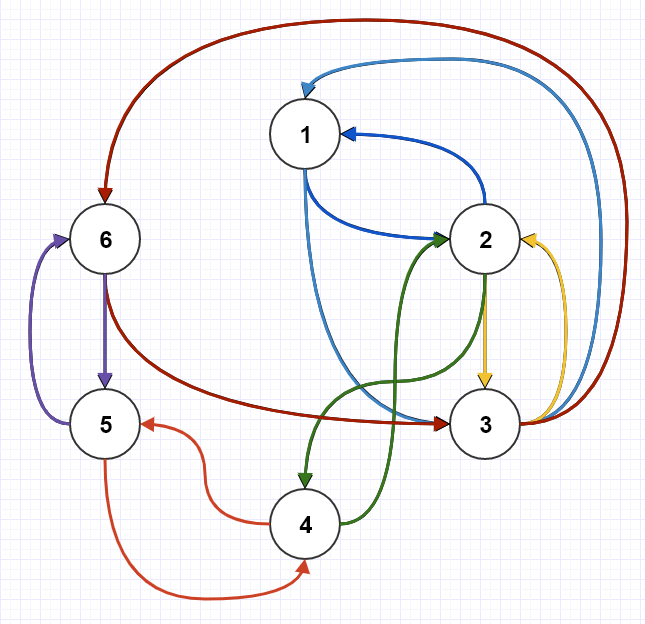

# Cycle Detection

## [문제](https://www.acmicpc.net/problem/7097)

그래프가 주어질 때, 아래 값을 출력하는 문제
1) 사이클의 개수
2) 각 사이클에 참여하는 노드의 개수를 오름차순으로


```
INPUT

6
0 1 1 0 0 0
1 0 1 1 0 0
1 1 0 0 0 1
0 1 0 0 1 0
0 0 0 1 0 1
0 0 1 0 1 0

OUTPUT
7
2 2 2 2 2 2 2
```


|각각의 사이클을 색깔로 표시했습니다|
|---|
||
