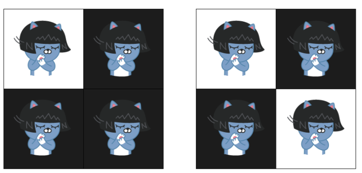

# 뒤집기 

[뒤집기 백준 링크](https://www.acmicpc.net/problem/15999)

## 문제 이해   

왼쪽의 상태를 만들 수 있는 초기 상태를 구하는 문제이다. 
판을 몇번을 눌러도 상관 없으며 해당 상태로 복구될 수 있는 모든 경우를 찾는 문제이다. 
* 4개의 판 중에서 한 곳을 누르면 해당 판을 포함해서 인접한 동일한 색의 판들의 색깔이 바뀌게 된다. 
### examples
* 왼쪽 그림에서 흰색 판을 누르면 해당 판만 검은색으로 바뀐다. 
* 왼쪽 그림에서 오른쪽 첫번째 검은색 판을 누르면 모든 판의 색깔이 흰색이 된다. 
* 오른쪽 그림에서 왼쪽 위에 판을 누르면 해당 판만 검은 색으로 바뀐다. 

## 풀이 전략

초기 상태 -> 상태1 -> 상태2 -> 현재 상태

1. 여기서 현재 상태가 주어졌을 때, 상태 2가 어떠한 경우인지 찾는다. 
2. 다시 상태2가 주어졌을 때, 가능한 상태 1을 찾는다. 
3. 따라서 회기적으로 초기 상태를 찾아간다. 여기서 말하는 초기상태는 Recursive의 끝이다. 
4. 따라서 더 이상 변화가 없는 경우이다. 
5. 문제에서 원하는 답은 경우의 수(상태2 X 상태1 X 초기 상태)이다. 

## 고민

상태2에서 상태1을 유추하게 되는데,

    상태2-1 -> 상태1-1
    상태2-2 -> 상태1-2 

이 경우, 상태 1-1과 상태 1-2가 중복될 수 있는지 의문이다. 

## 해결

아직

## 수도 코드

아직
